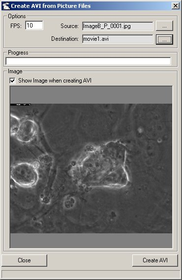



## Create AVI

### Description

Creates an AVI Movie File from BMP,GIF or JPG files. It takes all the pictures from one Directory and make's an AVI Movie.

(Updated version with more specific error handling)
 
### More Info
 
I used a lot of code from other Authors (not named here). Thanks!

Be Sure every file in the directory is of the same size. The order of loading is the order of the directory listing in the windows Explorer.

             |
---                |---
**Submitted On**   |2001-12-07 10:05:28
**By**             |[Ron Hoebe](https://github.com/Planet-Source-Code/PSCIndex/blob/master/ByAuthor/ron-hoebe.md)
**Level**          |Intermediate
**User Rating**    |4.9 (34 globes from 7 users)
**Compatibility**  |VB 6\.0
**Category**       |[Graphics](https://github.com/Planet-Source-Code/PSCIndex/blob/master/ByCategory/graphics__1-46.md)
**World**          |[Visual Basic](https://github.com/Planet-Source-Code/PSCIndex/blob/master/ByWorld/visual-basic.md)
**Archive File**   |[Create\_AVI400131272001\.zip](https://github.com/Planet-Source-Code/ron-hoebe-create-avi__1-29517/archive/master.zip)

### API Declarations

See the ZIP.

